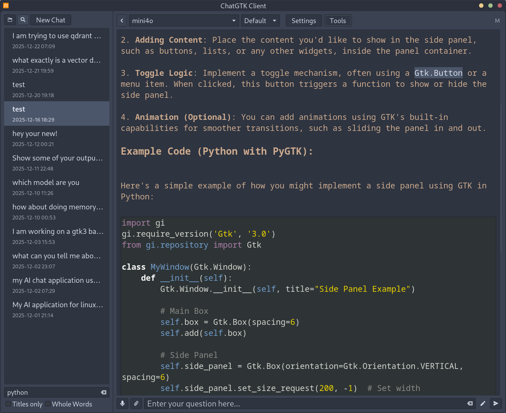
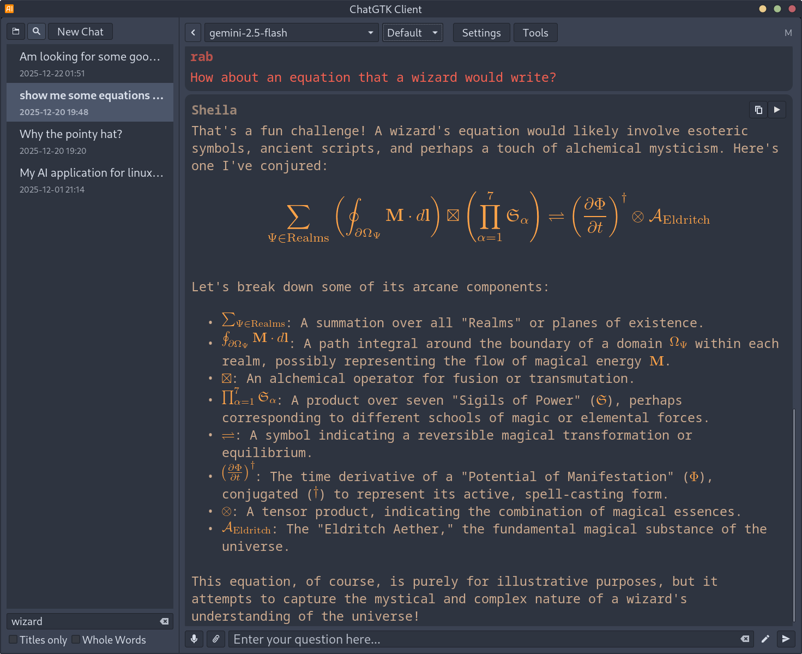
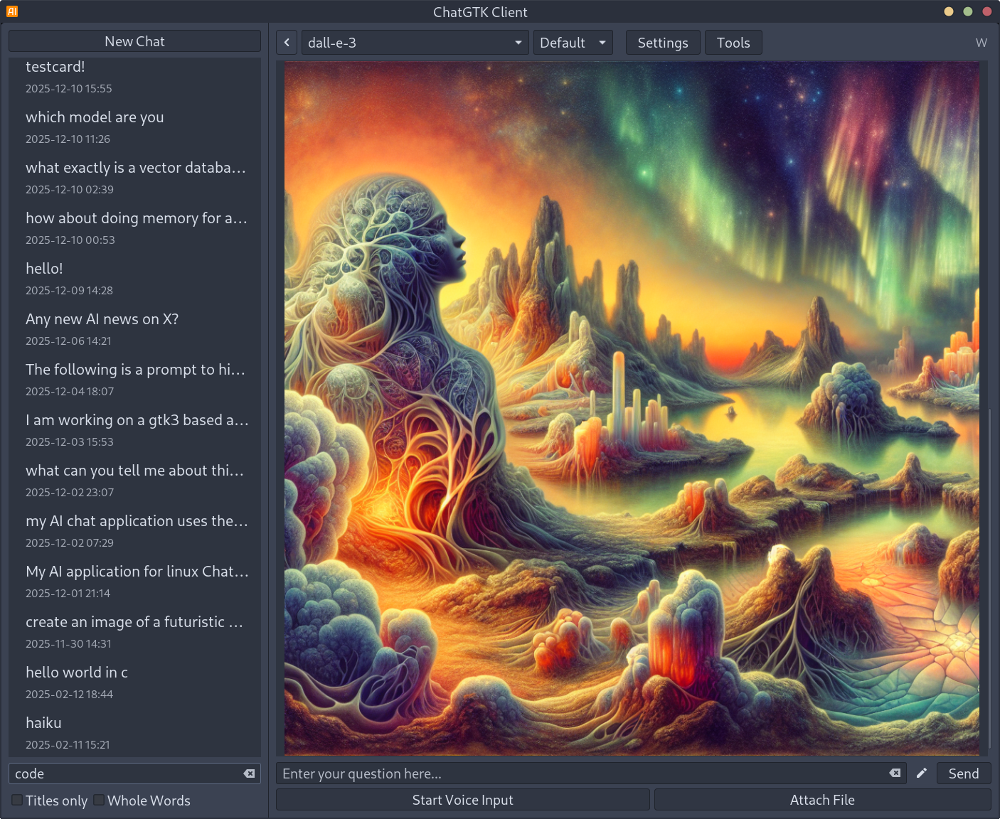
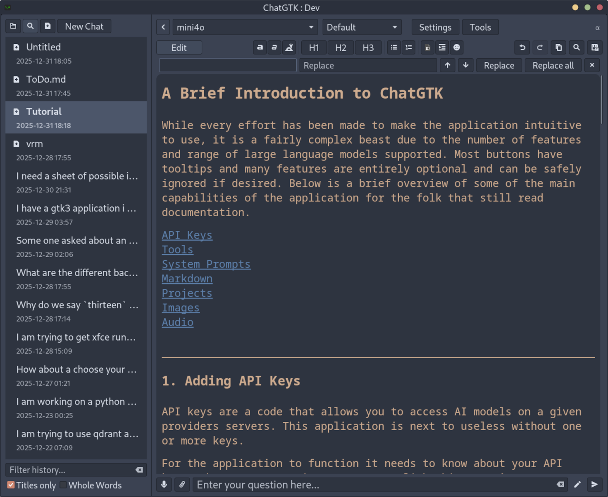

# ChatGTK - A Linux GTK Chat Client

A GTK-based Linux desktop client for OpenAI, Google Gemini, xAI Grok, Perplexity Sonar and Anthropic Claude APIs, featuring voice input/output and a clean interface. This project was primarily generated through AI assistance (Claude, O1, O3-mini, Grok, GPT 5.1).

## Features

- Clean GTK3 interface
- Voice to text for both the asking questions or dictation
- Syntax highlighting for code blocks
- LaTeX formula rendering
- Document mode to perform edits and help you write
- System prompt switching to tailor responses to the task at hand
- Organise your conversations and documents as projects
- Image generation by directly prompting image models or through function calling
- Export conversations and documents to PDF
- Text to Speech using what ever model and voice you choose
- Real-time voice conversation support using OpenAI's realtime models
- Reasoning level adjustment for capable models
- Tool use including music control, image generation, web search, Wolfram Alpha queries, and a read aloud tool that lets your assistant decide when to use TTS
- Multi-provider support for OpenAI, Gemini, xAI, Perplexity, Anthropic and 3rd parties

## Installation from AUR

If you are on Arch Linux or a derivative, you can install ChatGTK from the AUR:

AUR package: [chatgtk_client-git](https://aur.archlinux.org/packages/chatgtk_client-git)

## Quick Install (Virtual Environment)

Use the one-liner installer (master branch) to create a virtual environment and desktop entry:

```bash
curl -fsSL https://raw.githubusercontent.com/rabfulton/ChatGTK/master/installer.sh | bash
```

Or run it manually after cloning:

```bash
./installer.sh
```

## Manual Installation

```bash
git clone https://github.com/rabfulton/ChatGTK
cd ChatGTK
pip install -r requirements.txt
```
Or use your package manager to install the dependencies.  
- You optionally require `texlive` and `dvipng` if you want mathematics to render nicely.
- Install `beets` and `playerctl` if you want the music control functionality.
- Install `qdrant-client`, `qdrant` if you want to try the vector database for memory system.

Launch the application by running:
```bash
./chatgtk.sh
```
Optionally run the install script to add a desktop entry and set up the environment variables for you.
```bash
./install.sh
```

## Usage

The application looks for the following environment variables:

- `OPENAI_API_KEY` (Currently required for some audio functions)
- `GEMINI_API_KEY` (optional)
- `GROK_API_KEY` (optional)
- `CLAUDE_API_KEY` / `ANTHROPIC_API_KEY` (optional)
- `PERPLEXITY_API_KEY` (optional)

You will need at least one API key for the application to function. Alternatively you can manage API keys from within the app via the **API Keys** settings page or define a custom endpoint in the **Custom Models* settings page.

## Screenshots

*Syntax highlighting*


*Support for Equations*


*Image Generation*


*Document Mode*


## Getting API keys

- **OpenAI API key**  
  - Sign up or log in at [OpenAI's platform](https://platform.openai.com/signup).  
  - Go to your [API keys page](https://platform.openai.com/account/api-keys) and create a new key.  
  - Optionally manage billing/credits from your [billing page](https://platform.openai.com/account/billing/overview).  
  - Set the key in your shell, for example:
    ```bash
    export OPENAI_API_KEY="sk-..."
    ```

- **Google Gemini API key**  
  - Visit [Google AI Studio](https://aistudio.google.com/).  
  - Create or select a project and generate an API key from the *API keys* section (often available at `https://aistudio.google.com/app/apikey`).  
  - Set the key:
    ```bash
    export GEMINI_API_KEY="your-gemini-key"
    ```

- **Grok (xAI) API key**  
  - Sign up or log in at [xAI](https://x.ai/) and open the developer console (e.g. `https://console.x.ai`).  
  - Create a new API key for the Grok models.  
  - Set the key:
    ```bash
    export GROK_API_KEY="your-grok-key"
    ```
 
- **Anthropic Claude API key**  
  - Sign up or log in at [Anthropic Console](https://console.anthropic.com/) or [Claude platform](https://platform.claude.com/).  
  - Create an API key for Claude models (e.g. `claude-sonnet-4-5`, `claude-haiku-4-5`).  
  - Set the key (either of these is accepted by the app):
  ```bash
  export CLAUDE_API_KEY="sk-ant-..."
  # or
  export ANTHROPIC_API_KEY="sk-ant-..."
  ```
  - Claude support is implemented using Anthropic's OpenAI SDK compatibility layer as documented at  
    `https://platform.claude.com/docs/en/api/openai-sdk`.
- **Perplexity Sonar API key**
  - create an API key at [Perplexity](https://perplexity.ai/account/api/keys)
  - set the key:
    ```bash
    export PERPLEXITY_API_KEY="your-perplexity-key"
    ```
- **Custom Providers**
  - You can integrate any custom provider that has an OpenAPI compatible endpoint.
  - Keys can be set as environment variables or inside the applications settings.
  - I have tested Openrouter, Mistral, Nvidia Cloud, Groq and Bytedance so far.

## Custom Models

ChatGTK supports adding custom models from any OpenAI-compatible API endpoint. This allows you to use models from services like OpenRouter, Together AI, or your own self-hosted models.

- **Accessing Custom Models**
  - Open **Settings** (from the top menu or via keyboard shortcut)
  - Navigate to the **Custom Models** page in the sidebar
  - Click **Add Custom Model** to create a new custom model configuration

- **Configuring a Custom Model**
  - **Model ID** (required): A unique identifier for the model (e.g., `deepseek/deepseek-v3.2`)
  - **Display Name** (optional): A friendly name shown in the model dropdown (e.g., `DeepSeek V3.2`)
  - **Endpoint URL** (required): The API endpoint URL (e.g., `https://openrouter.ai/api/v1` or `https://api.together.xyz/v1`)
  - **API Key** (optional): Your API key for the service. If not provided, you may need to set it via environment variable or the service's default authentication method
  - **API Type**: Select the API format your endpoint uses:
    - `chat.completions`: Standard OpenAI chat completions API format
    - `responses`: OpenAI Responses API format (supports web search and tools)
    - `images`: Image generation API format - not tested yet
    - `tts`: Text-to-speech API format - not tested yet

- **Managing Custom Models**
  - **Test**: Click the **Test** button to verify the connection and API key work correctly
  - **Edit**: Click **Edit** to modify an existing custom model configuration
  - **Delete**: Click **Delete** to remove a custom model

- **Using Custom Models**
  - Once configured, custom models appear in the model dropdown alongside built-in providers
  - Custom models using the `chat.completions` or `responses` API types support tools (image generation, music control, read aloud) if enabled
  - Custom models are saved to `custom_models.json` in the application directory

- **Example Use Cases**
  - **OpenRouter**: Connect to models from multiple providers through OpenRouter's unified API
  - **Self-hosted models**: Use local or remote self-hosted models with OpenAI-compatible APIs
  - **Alternative providers**: Access models from services like Together AI, Anyscale, or other compatible providers

## Document Mode

Document Mode provides a focused editing environment for creating and refining long-form content with AI assistance. Instead of a back-and-forth chat, you work on a single document that the AI can read and edit directly.

- **Creating Documents**
  - Click the document icon (📄) in the sidebar to create a new document
  - Documents are saved per-project, just like chats
  - Right-click documents in the sidebar to rename or delete them

- **Edit and Preview Modes**
  - **Edit mode**: Raw markdown editing with syntax highlighting
  - **Preview mode**: Click the Preview button to see rendered content with formatted text, LaTeX equations, and code highlighting
  - Toggle between modes while working

- **AI-Assisted Editing**
  - Use the Prompt box to let the AI modify your document directly
  - The AI can read the current document content and apply targeted edits
  - Each AI edit can be undone using the undo button in the toolbar
  - Manual edits (your typing) are auto-saved but don't create undo points

- **Export**
  - Export documents to PDF with full formatting (LaTeX, code highlighting, etc.)
  - Uses the same rendering as chat exports

- **Workflow**
  - Create a document and write initial content or ask AI to create an outline of what you want
  - Ask the AI to expand, refine, restructure, or edit specific sections
  - Review changes in preview mode
  - Undo AI edits if needed, or continue iterating

## Tools Support

- **Image tool (`generate_image`)**
  - Enabled by the **Enable Image Tool** switch in the **Tools** dialog (top bar → *Tools*).
  - Uses your preferred **Image Model** from the main **Settings** dialog.
  - Available to supported OpenAI, Gemini, Grok, and Claude chat models via function/tool calling.
  - If you are using a model with native image tools such as GPT-5, the image tool, when enabled, will override the native capability and use your preferred image generations model.

- **Music control tool (`control_music`)**
  - Disabled by default; enable via **Enable Music Tool** in the **Tools** dialog.
  - Lets the model play music from your local [beets](https://beets.io/) music library using a configurable player (default: `mpv`).
  - The assistant translates natural language requests into **beets query strings** for smart playlist generation. Examples:
    - "Play some 80s music" → `year:1980..1989`
    - "Play jazz from the 1950s" → `genre:jazz year:1950..1959`
    - "Play something by Pink Floyd" → `artist:"Pink Floyd"`
  - Configure via **Settings → Tool Options → Music Tool**:
    - **Music Player Executable**: path to your music player and required arguments to play a playlist (e.g. `/usr/bin/audacioius -p <playlist>`)
    - **Music Library Directory**: directory where your music files are stored
    - **Beets Library DB** (optional): path to your beets `library.db` file; leave empty to use app-generated library
    - **Generate Library** button: scans your Music Library Directory and creates a beets library automatically (no need to run `beet import` manually)
  - Non-play actions (pause, resume, stop, next, previous) require `playerctl` for MPRIS control.

- **Read Aloud tool (`read_aloud`)**
  - Disabled by default; enable via **Enable Read Aloud Tool** in the **Tools** dialog (top bar → *Tools*) or **Settings → Tool Options**.
  - Allows models to choose to speak text aloud to the user using text-to-speech.
  - Configure Read Aloud settings via **Settings → Audio** (near TTS settings):
    - **Automatically read responses aloud**: when enabled, all assistant responses are automatically spoken. Note: this option and the Read Aloud Tool are mutually exclusive.
    - **Read Aloud Provider**: choose between OpenAI TTS (`tts-1` / `tts-1-hd`) or audio-preview models (`gpt-4o-audio-preview`, `gpt-4o-mini-audio-preview`).
    - **Read Aloud prompt template**: for audio-preview models, customize the prompt used to instruct the model what to say. Use `{text}` as a placeholder for the response text. Default: `Please say the following verbatim in a New York accent: "{text}"`.
  - Available to supported OpenAI, Gemini, Grok, and Claude chat models via function/tool calling.
  - To use the tools just ask your model "Write me a short poem and read it aloud".

- **Search tool (`search_memory`)**
  - Disabled by default; enable via **Enable Search Tool** in the **Tools** dialog (top bar → *Tools*) or **Settings → Tool Options**.
  - Allows models to search past conversations and optionally configured directories for information using word-boundary matching (e.g., "dog" matches "dog," and "dog." but not "doggedly").
  - Searches both user questions and assistant responses from your conversation history (system messages are excluded).
  - Configure via **Settings → Tool Options → Search/Memory Tool**:
    - **Enable Search Tool**: master toggle to enable/disable the tool.
    - **Search Conversation History**: when enabled, searches past conversations in your history folder.
    - **Search Directories**: comma-separated list of directories to search for text files (.txt, .md, .json, .log, .csv).
    - **Result Limit**: maximum number of results to return (1-5).
    - **Show Results in Chat**: when enabled, search results appear in the chat window; when disabled, results are only sent to the model silently.
  - The current conversation is automatically excluded from search results to avoid circular references.
  - Example usage: "Do you remember what we discussed about Python decorators?" or "Search my notes for information about project deadlines".

- **Text edit tools (`text_get`, `apply_text_edit`)**
  - Disabled by default; enable via **Enable Text Edit Tool** in the **Tools** dialog (top bar → *Tools*) or **Settings → Tool Options**.
  - Lets the model read and edit a selected target file using function/tool calls.
  - Usage flow:
    - Click the attach button (paperclip) to select a target file. When a target is set, the icon switches to a file indicator.
  - The model uses `text_get` with `target="file"` to read the current text.
  - The model uses `apply_text_edit` with `operation="search_replace"` (preferred), then `replace`, then `diff`.
  - Notes:
    - Diff edits use the system `patch` utility; ensure it is installed.
    - The target selection is per‑chat and restored when reopening the chat.
    - Messages that apply edits include an undo button in the header to revert the last tool edit.

- **Wolfram Alpha tool (`wolfram_alpha`)**
  - Disabled by default; enable via **Enable Wolfram Alpha Tool** in the **Tools** dialog (top bar → *Tools*) or **Settings → Tool Options**.
  - Requires a Wolfram Alpha App ID (Settings → API Keys → Wolfram Alpha App ID).
  - Best for math, unit conversion, factual queries, and scientific data where Wolfram Alpha has structured knowledge.
  - The assistant can call the tool automatically and will summarize the most useful parts of the result.

- **Web search (provider-native tools)**
  - Disabled by default; enable via **Enable Web Search** in the **Tools** dialog (top bar → *Tools*) or **Settings → Tool Options**.
  - For **OpenAI models**, this uses the built-in `web_search` tool described in the OpenAI tools docs ([OpenAI web search guide](https://platform.openai.com/docs/guides/tools/web-search?api-mode=responses)).
  - For **Gemini models**, this uses Grounding with Google Search via the `google_search` tool as documented in the Gemini API ([Gemini Google Search grounding](https://ai.google.dev/gemini-api/docs/google-search)).
  - For Grok, this uses both a built-in `web_search` tool and a builtin `x_search` tool when appropriate.
  - Only models that support these tools will be configured to use them; when enabled, the assistant can automatically call web search when it needs fresh, real‑world information and return grounded answers with citations.

## Memory System

ChatGTK supports three complementary memory mechanisms that can be used separately or together to give your assistant context awareness:

### 1. Conversation Buffer (Short-term Memory)
Controls how many recent messages are sent to the model in each request.

- Configure via **Settings → General → Conversation Buffer Length**
- Options: `ALL` (entire conversation), or a specific number (e.g., `10`, `20`, `50`)
- Setting a limit helps manage token costs for long conversations while keeping recent context
- Acts as "working memory" - the model sees recent exchanges but older messages are not sent

### 2. Search Tool (Long-term Recall)
Allows the model to search past conversations and local documents using keyword matching.

- Enable via **Tools** dialog or **Settings → Tool Options → Search/Memory Tool**
- Uses word-boundary grep-style matching (e.g., "dog" matches "dog," but not "doggedly")
- Can search:
  - **Conversation history**: All saved chats (current conversation excluded)
  - **Local directories**: Text files (.txt, .md, .json, .log, .csv) in configured folders
- The model decides when to search based on user questions like "What did we discuss about X?"
- Returns matching message snippets with source attribution
- Configure **Show Results in Chat** to control whether results appear in the UI or only go to the model

### 3. Semantic Memory (Vector Database)
Provides intelligent, meaning-based recall using embeddings and a vector database.

- Enable via **Settings → Memory** page
- Requires optional dependencies: `qdrant-client` and optionally `sentence-transformers` for local embeddings
- **Embedding Providers**:
  - **Local**: Uses sentence-transformers (e.g., `all-MiniLM-L6-v2`) - runs offline, no API costs
  - **OpenAI**: Uses `text-embedding-3-small` or other OpenAI embedding models
  - **Gemini**: Uses Google's `text-embedding-004` model
  - **Custom**: Any OpenAI-compatible `/v1/embeddings` endpoint, tested using `mistral-embed`
- **How it works**:
  - Messages are automatically converted to embeddings and stored in a local Qdrant database
  - When you chat, relevant past context is retrieved based on semantic similarity
  - Retrieved memories are injected into the conversation as additional context
- **Configuration options**:
  - **Store Mode**: Store `all` messages, only `user` messages, or only `assistant` messages
  - **Auto Import**: Automatically store new messages as they occur
  - **Top K**: Number of relevant memories to retrieve (1-20)
  - **Min Similarity**: Threshold for memory relevance (0.0-1.0)
- **Import existing history**: Use the **Import** button to index your existing conversation history
- Unlike the Search Tool, semantic memory finds conceptually related content even without exact keyword matches

### Combining Memory Types
- Use **Conversation Buffer** for immediate context (what was just discussed)
- Use **Search Tool** for explicit recall ("find where we talked about X")
- Use **Semantic Memory** for automatic, intelligent context injection
- All three can be enabled simultaneously for comprehensive memory coverage

## FAQ

### gpt-image-1 is not working
OpenAI requires identity verification for some of their models. You can verify your identity [here](https://platform.openai.com/settings/organization/general).
### Music tool is not working
Set your **Music Library Directory** in **Settings → Tool Options**, then click the **Generate Library** button to scan your music files. Verify your **Music Player Executable** path is correct (default: `/usr/bin/audacious -p <playlist>`). Alternatively, if you already have a beets library, you can specify its path in the **Beets Library DB** field.
### Web search is not working
Web search is only supported on certain models. For OpenAI, supported models include: `gpt-4o`, `gpt-4o-mini`, `gpt-4-turbo`, and `gpt-5.x` models. For Gemini, supported models include `gemini-2.x` and `gemini-3.x` models. Older models like `gpt-3.5-turbo` or `gemini-1.5` do not support web search. Newer Grok models should work and can also be asked to search X.
### Fonts look bad in exported PDF
install `texlive-fontsrecommended` from your package manager.

## Requirements

### Python Packages
- openai>=1.0.0
- PyGObject>=3.42.0
- sounddevice>=0.4.6
- soundfile>=0.12.1
- numpy>=1.24.0
- pathlib>=1.0.1
- beets>=1.6.0 (optional, for music control tool)

### System Dependencies
- `openai`
- `python3`
- `gtk-3.0`
- `gtksourceview4`
- `pulseaudio`
- `websockets`
- `requests`
- `texlive` (for LaTeX support)
- `dvipng` (for LaTeX rendering)
- `texlive-fontsrecommended` (For better looking exported PDF's)
- Optional, for music control tool:
  - A music player such as `vlc` (configurable in Settings)
  - A [beets](https://beets.io/) music library (import your music with `beet import /path/to/music`)
- `playerctl` (optional, for pause/resume/stop/next/previous controls via MPRIS)
- `qdrant-client`, `qdrant` Optional vector database for memory system
- `sentence-transformers` Optional to support local embedding model for memory system

<a href="https://www.buymeacoffee.com/rabfulton" target="_blank"></a>
