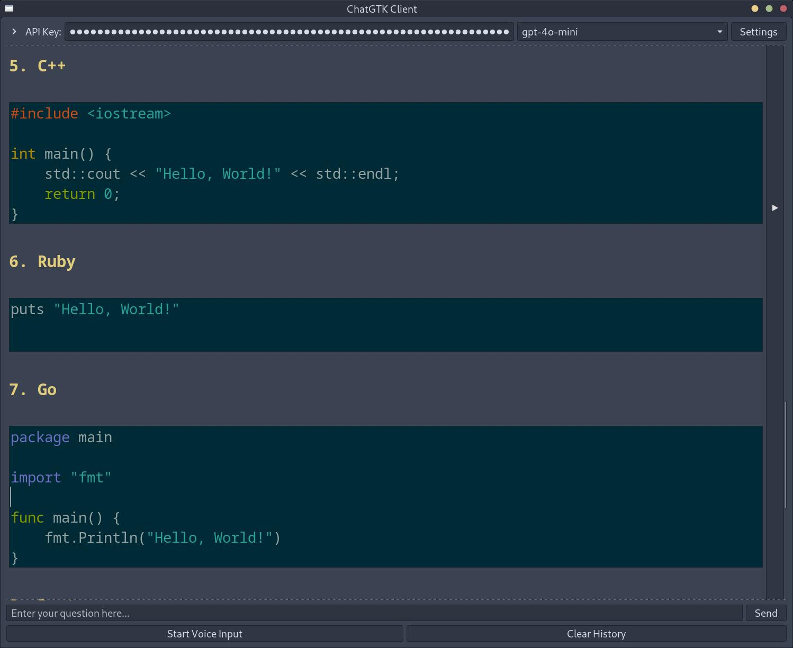
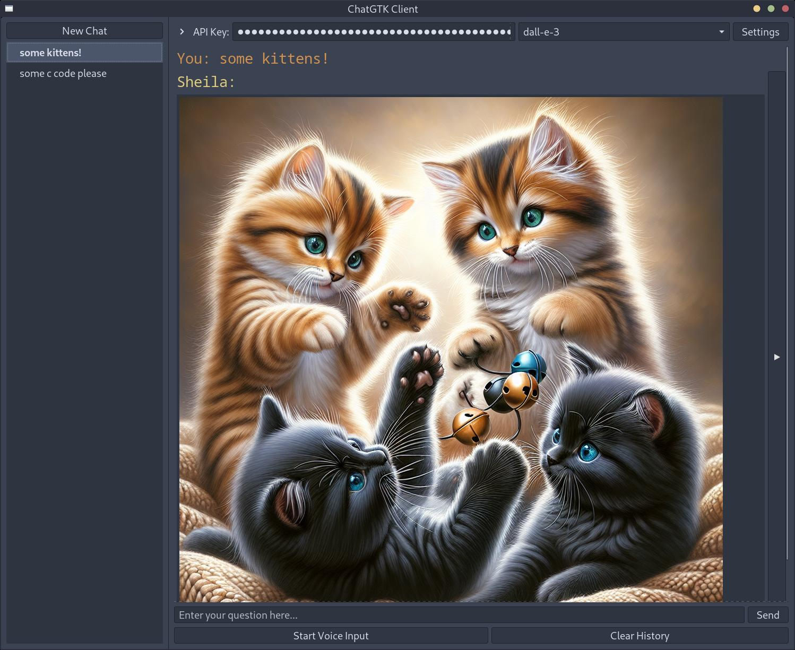

# ChatGTK - OpenAI / Gemini / Grok / Claude Chat Client

A GTK-based Linux desktop client for OpenAI, Google Gemini, xAI Grok, and Anthropic Claude APIs, featuring voice input/output and a clean interface. This project was primarily generated through AI assistance (Claude, O1, O3-mini, Grok, GPT 5.1).

Disclaimer: Written almost entirely by AI, I accept no responsibility for what happens to your computer if you choose to run this code!

## Installation

```bash
git clone https://github.com/rabfulton/ChatGTK
cd ChatGTK
pip install -r requirements.txt
```
Or use your package manager to install the dependencies. The application when launched from the terminal will complain about which dependencies are missing.

## Usage

The application looks for the following environment variables:

- `OPENAI_API_KEY` (required for OpenAI models)
- `GEMINI_API_KEY` (optional, used for Google Gemini models)
- `GROK_API_KEY` (optional, used for xAI Grok models)
- `CLAUDE_API_KEY` / `ANTHROPIC_API_KEY` (optional, used for Anthropic Claude models via the OpenAI SDK compatibility layer)

You can also manage API keys from within the app via the **API Keys** button in the top bar; any keys set in the environment will be picked up automatically on launch.

### Getting API keys

- **OpenAI API key**  
  - Sign up or log in at [OpenAI's platform](https://platform.openai.com/signup).  
  - Go to your [API keys page](https://platform.openai.com/account/api-keys) and create a new key.  
  - Optionally manage billing/credits from your [billing page](https://platform.openai.com/account/billing/overview).  
  - Set the key in your shell, for example:
    ```bash
    export OPENAI_API_KEY="sk-..."
    ```

- **Google Gemini API key**  
  - Visit [Google AI Studio](https://aistudio.google.com/).  
  - Create or select a project and generate an API key from the *API keys* section (often available at `https://aistudio.google.com/app/apikey`).  
  - Set the key:
    ```bash
    export GEMINI_API_KEY="your-gemini-key"
    ```

- **Grok (xAI) API key**  
  - Sign up or log in at [xAI](https://x.ai/) and open the developer console (e.g. `https://console.x.ai`).  
  - Create a new API key for the Grok models.  
  - Set the key:
    ```bash
    export GROK_API_KEY="your-grok-key"
    ```
 
- **Anthropic Claude API key (via OpenAI SDK compatibility)**  
  - Sign up or log in at [Anthropic Console](https://console.anthropic.com/) or [Claude platform](https://platform.claude.com/).  
  - Create an API key for Claude models (e.g. `claude-sonnet-4-5`, `claude-haiku-4-5`).  
  - Set the key (either of these is accepted by the app):
  ```bash
  export CLAUDE_API_KEY="sk-ant-..."
  # or
  export ANTHROPIC_API_KEY="sk-ant-..."
  ```
  - Claude support is implemented using Anthropic's OpenAI SDK compatibility layer as documented at  
    `https://platform.claude.com/docs/en/api/openai-sdk`.

```bash
./chatgtk.sh
```
Alternatively you can run the install script to add a desktop entry and set up the environment.
```bash
./install.sh
```
## Features

- Clean GTK3 interface
- Voice to text input using Whisper API
- Syntax highlighting for code blocks
- LaTeX formula rendering
- Customizable settings
- Conversation history management
- Image generation using Dall-e-3 model, use the "img:" prefix to quickly access the model.
- Export chats to PDF by right-clicking on a chat and selecting "Export Chat"
- Text-to-Speech output using OpenAI's TTS and TTS-HD models
- Real-time voice conversation support using gpt-4o-realtime-preview model
- Text to audio output using gpt-4o-audio-preview model
- Reasoning support for OpenAI's o3 models
- "export DISABLE_MODEL_FILTER=1" if you require an unfiltered list of models in the app.
- Multi-provider support for OpenAI, Google Gemini 3 series models, xAI Grok, and Anthropic Claude via separate API keys.

### Tools support (images, music & read aloud)

- **Image tool (`generate_image`)**
  - Enabled by the **Enable Image Tool** switch in the **Tools** dialog (top bar → *Tools*).
  - Uses your preferred **Image Model** from the main **Settings** dialog.
  - Available to supported OpenAI, Gemini, Grok, and Claude chat models via function/tool calling.

- **Music control tool (`control_music`)**
  - Disabled by default; enable via **Enable Music Tool** in the **Tools** dialog.
  - Lets the model control your local music playback through the [`kew` terminal music player](https://github.com/ravachol/kew) and MPRIS.
  - Supported actions: `play` (with a keyword/song/album/artist), `pause`, `resume`, `stop`, `next`, `previous`, `volume_up`, `volume_down`, `set_volume`.
  - You can optionally have `kew` run inside its own terminal window via **Settings → Tool Options → Music Tool**:
    - **Launch kew in terminal**: when enabled, the app starts `kew` through your preferred terminal instead of headless.
    - **Terminal command prefix**:
      - Simple prefixes (no `{cmd}`), e.g. `gnome-terminal --` or `konsole -e`  
        → the app appends the `kew` command and arguments for you.
      - Template mode using `{cmd}` for terminals that require a full command string (e.g. `xfce4-terminal`):  
        - Example for Xfce:  
          - `xfce4-terminal --command="{cmd}"`  
          - The app expands `{cmd}` to something like `kew -q Bach` before launching.
        - Example for Kitty / Alacritty via a shell:  
          - `kitty sh -c "{cmd}"` or `alacritty -e sh -c "{cmd}"`.
      - If you're unsure, start with your terminal's binary name plus its recommended "execute command" flag, and test a simple play request; any launch errors are printed to the terminal where you started ChatGTK.

- **Read Aloud tool (`read_aloud`)**
  - Disabled by default; enable via **Enable Read Aloud Tool** in the **Tools** dialog (top bar → *Tools*) or **Settings → Tool Options**.
  - Allows models to speak text aloud to the user using text-to-speech.
  - Configure Read Aloud settings via **Settings → General** (near TTS settings):
    - **Automatically read responses aloud**: when enabled, all assistant responses are automatically spoken. Note: this option and the Read Aloud Tool are mutually exclusive.
    - **Read Aloud Provider**: choose between OpenAI TTS (`tts-1` / `tts-1-hd`) or audio-preview models (`gpt-4o-audio-preview`, `gpt-4o-mini-audio-preview`).
    - **Read Aloud prompt template**: for audio-preview models, customize the prompt used to instruct the model what to say. Use `{text}` as a placeholder for the response text. Default: `Please say the following verbatim in a New York accent: "{text}"`.
  - Available to supported OpenAI, Gemini, Grok, and Claude chat models via function/tool calling.

## Screenshots

*Syntax highlighting*


*Support for Equations*


*Image Generation*


## Python Packages
- openai>=1.0.0
- PyGObject>=3.42.0
- sounddevice>=0.4.6
- soundfile>=0.12.1
- numpy>=1.24.0
- pathlib>=1.0.1

## System Dependencies
- python3
- gtk-3.0
- gtksourceview4
- pulseaudio
- texlive (for LaTeX support)
- dvipng (for LaTeX rendering)
 - Optional, for music control tool:
   - [`kew` terminal music player](https://github.com/ravachol/kew) (must be on `PATH`)
   - `playerctl` (for MPRIS-based playback control)

## FAQ

**gpt-image-1 is not working**<br>
OpenAI requires identity verification for some of their models. You can verify your identity [here](https://platform.openai.com/settings/organization/general).<br>
**Music tool is not working**<br>
After installation you must inform `kew` where your music is stored by running `kew path "/path/to/My_Music/"` from your terminal.<br>

<a href="https://www.buymeacoffee.com/rabfulton" target="_blank"></a>