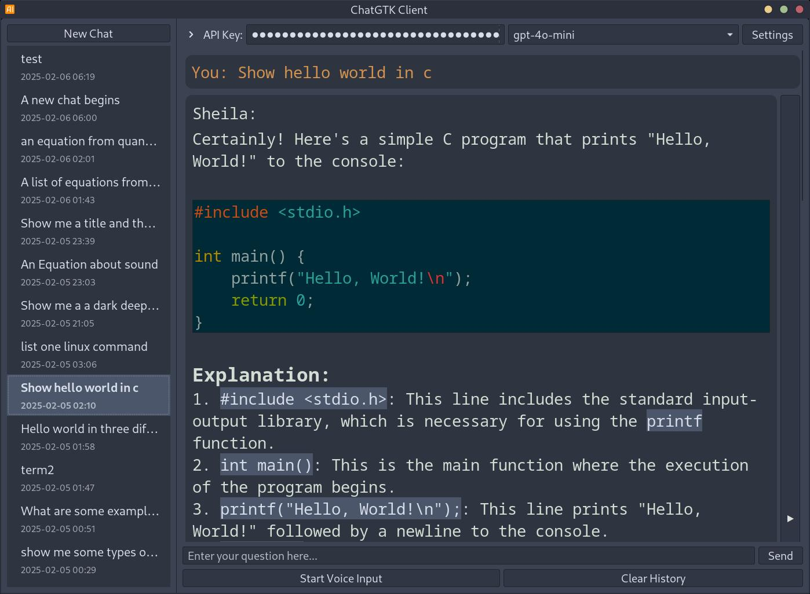

# ChatGTK - OpenAI Chat Client

A GTK-based Linux desktop client for OpenAI's API, featuring voice input/output and a clean interface. This project was primarily generated through AI assistance (Claude, O1, O3-mini).

Disclaimer: Written entirely by AI, I accept no resposibility for what happens to your computer if you choose to run this code!

## Installation

```bash
git clone https://github.com/rabfulton/ChatGTK
cd ChatGTK
pip install -r requirements.txt
```
Or use your package manager to install the dependencies. The application when launched from the terminal will complain about which dependencies are missing.

## Usage
The application looks for an enviroment variable: $OPENAI_API_KEY

You can get API credits by signing up at [OpenAI's platform](https://platform.openai.com/signup). Credits can be purchased from your [OpenAI account page](https://platform.openai.com/account/billing/overview). Credits are very cheap compared to a subscription to the ChatGTP application. You need to create an API key to use the application.

```bash
./chatgtk.sh
```
Alternatively you can run the install script to add a desktop entry and set up the environment variable.
```bash
./install.sh
```
## Features

- Clean GTK3 interface
- Voice input with Whisper API
- Text-to-Speech output
- Syntax highlighting for code blocks
- LaTeX formula rendering
- Customizable settings
- Conversation history management
- Image generation using Dall-e-3 model, use the "img:" prefix to quickly access the model.
- Export chats to PDF by right-clicking on a chat and selecting "Export Chat"

## Screenshots

*Syntax highlighting*


*Support for Equations*


*Image Generation*


## Python Packages
- openai>=1.0.0
- PyGObject>=3.42.0
- sounddevice>=0.4.6
- soundfile>=0.12.1
- numpy>=1.24.0
- pathlib>=1.0.1

## System Dependencies
- python3
- gtk-3.0
- gtksourceview4
- pulseaudio
- texlive (for LaTeX support)
- dvipng (for LaTeX rendering)

<a href="https://www.buymeacoffee.com/rabfulton" target="_blank"></a>