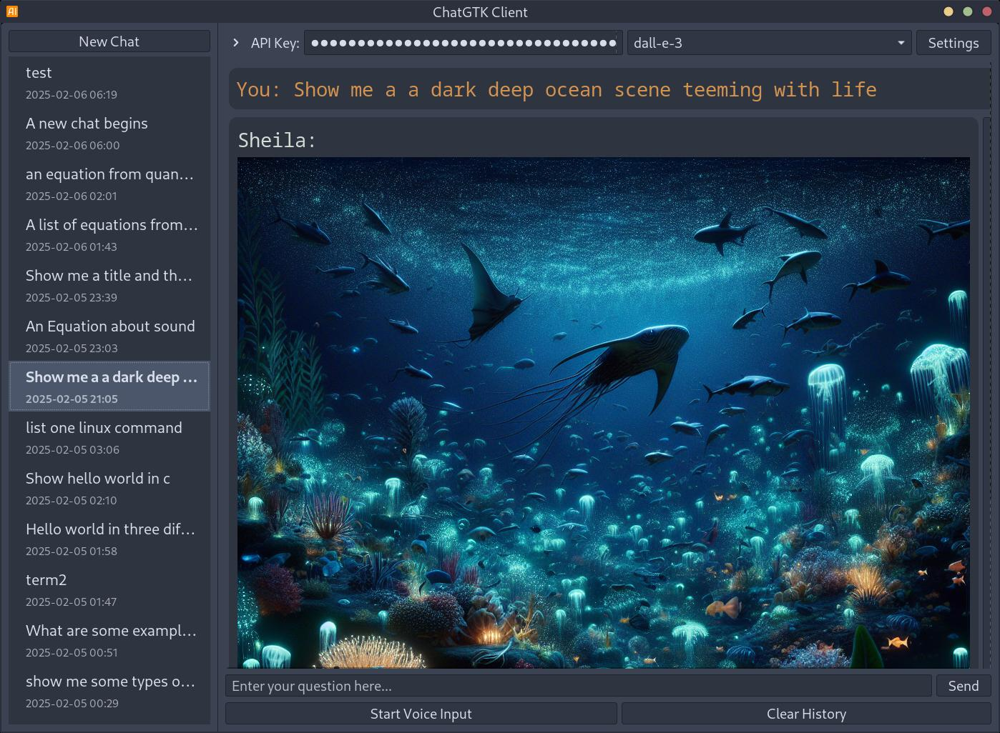

# ChatGTK - OpenAI / Gemini / Grok / Claude Chat Client

A GTK-based Linux desktop client for OpenAI, Google Gemini, xAI Grok, and Anthropic Claude APIs, featuring voice input/output and a clean interface. This project was primarily generated through AI assistance (Claude, O1, O3-mini, Grok, GPT 5.1).

Disclaimer: Written almost entirely by AI, I accept no responsibility for what happens to your computer if you choose to run this code!

## Installation

```bash
git clone https://github.com/rabfulton/ChatGTK
cd ChatGTK
pip install -r requirements.txt
```
Or use your package manager to install the dependencies. The application when launched from the terminal will complain about which dependencies are missing.

## Usage

The application looks for the following environment variables:

- `OPENAI_API_KEY` (required for OpenAI models)
- `GEMINI_API_KEY` (optional, used for Google Gemini models)
- `GROK_API_KEY` (optional, used for xAI Grok models)
- `CLAUDE_API_KEY` / `ANTHROPIC_API_KEY` (optional, used for Anthropic Claude models via the OpenAI SDK compatibility layer)

You can also manage API keys from within the app via the **API Keys** button in the top bar; any keys set in the environment will be picked up automatically on launch.

### Getting API keys

- **OpenAI API key**  
  - Sign up or log in at [OpenAI's platform](https://platform.openai.com/signup).  
  - Go to your [API keys page](https://platform.openai.com/account/api-keys) and create a new key.  
  - Optionally manage billing/credits from your [billing page](https://platform.openai.com/account/billing/overview).  
  - Set the key in your shell, for example:
    ```bash
    export OPENAI_API_KEY="sk-..."
    ```

- **Google Gemini API key**  
  - Visit [Google AI Studio](https://aistudio.google.com/).  
  - Create or select a project and generate an API key from the *API keys* section (often available at `https://aistudio.google.com/app/apikey`).  
  - Set the key:
    ```bash
    export GEMINI_API_KEY="your-gemini-key"
    ```

- **Grok (xAI) API key**  
  - Sign up or log in at [xAI](https://x.ai/) and open the developer console (e.g. `https://console.x.ai`).  
  - Create a new API key for the Grok models.  
  - Set the key:
    ```bash
    export GROK_API_KEY="your-grok-key"
    ```
 
- **Anthropic Claude API key (via OpenAI SDK compatibility)**  
  - Sign up or log in at [Anthropic Console](https://console.anthropic.com/) or [Claude platform](https://platform.claude.com/).  
  - Create an API key for Claude models (e.g. `claude-sonnet-4-5`, `claude-haiku-4-5`).  
  - Set the key (either of these is accepted by the app):
  ```bash
  export CLAUDE_API_KEY="sk-ant-..."
  # or
  export ANTHROPIC_API_KEY="sk-ant-..."
  ```
  - Claude support is implemented using Anthropic's OpenAI SDK compatibility layer as documented at  
    `https://platform.claude.com/docs/en/api/openai-sdk`.

```bash
./chatgtk.sh
```
Alternatively you can run the install script to add a desktop entry and set up the environment.
```bash
./install.sh
```
## Features

- Clean GTK3 interface
- Voice to text input using Whisper API
- Syntax highlighting for code blocks
- LaTeX formula rendering
- Customizable settings
- Conversation history management
- Image generation using both OpenAI's and Googles models.
- Export chats to PDF by right-clicking on a chat and selecting "Export Chat"
- Text-to-Speech output using OpenAI's TTS and TTS-HD and audio-preview models
- Real-time voice conversation support using gpt-4o-realtime-preview model
- Reasoning support for OpenAI's o3 models
- Tool use including music control, image generation, web search, and a read aloud tool that lets your assistant decide when to use TTS.
- Multi-provider support for OpenAI, Google Gemini 3 series models, xAI Grok, and Anthropic Claude via separate API keys.
- Web search grounding for OpenAI and Gemini models to provide up-to-date, cited answers.

### Tools support (images, music, web search & read aloud)

- **Image tool (`generate_image`)**
  - Enabled by the **Enable Image Tool** switch in the **Tools** dialog (top bar → *Tools*).
  - Uses your preferred **Image Model** from the main **Settings** dialog.
  - Available to supported OpenAI, Gemini, Grok, and Claude chat models via function/tool calling.

- **Music control tool (`control_music`)**
  - Disabled by default; enable via **Enable Music Tool** in the **Tools** dialog.
  - Lets the model play music from your local [beets](https://beets.io/) music library using a configurable player (default: `mpv`).
  - The assistant translates natural language requests into **beets query strings** for smart playlist generation. Examples:
    - "Play some 80s music" → `year:1980..1989`
    - "Play jazz from the 1950s" → `genre:jazz year:1950..1959`
    - "Play something by Pink Floyd" → `artist:"Pink Floyd"`
  - Configure via **Settings → Tool Options → Music Tool**:
    - **Music Player Executable**: path to your music player and required arguments to play a playlist (e.g. `/usr/bin/audacioius -p <playlist>`)
    - **Music Library Directory**: directory where your music files are stored
    - **Beets Library DB** (optional): path to your beets `library.db` file; leave empty to use app-generated library
    - **Generate Library** button: scans your Music Library Directory and creates a beets library automatically (no need to run `beet import` manually)
  - Non-play actions (pause, resume, stop, next, previous) require `playerctl` for MPRIS control.

- **Read Aloud tool (`read_aloud`)**
  - Disabled by default; enable via **Enable Read Aloud Tool** in the **Tools** dialog (top bar → *Tools*) or **Settings → Tool Options**.
  - Allows models to choose to speak text aloud to the user using text-to-speech.
  - Configure Read Aloud settings via **Settings → Audio** (near TTS settings):
    - **Automatically read responses aloud**: when enabled, all assistant responses are automatically spoken. Note: this option and the Read Aloud Tool are mutually exclusive.
    - **Read Aloud Provider**: choose between OpenAI TTS (`tts-1` / `tts-1-hd`) or audio-preview models (`gpt-4o-audio-preview`, `gpt-4o-mini-audio-preview`).
    - **Read Aloud prompt template**: for audio-preview models, customize the prompt used to instruct the model what to say. Use `{text}` as a placeholder for the response text. Default: `Please say the following verbatim in a New York accent: "{text}"`.
  - Available to supported OpenAI, Gemini, Grok, and Claude chat models via function/tool calling.
  - To use the tools just ask your model "Write me a short poem and read it aloud".

- **Web search (provider-native tools)**
  - Disabled by default; enable via **Enable Web Search** in the **Tools** dialog (top bar → *Tools*) or **Settings → Tool Options**.
  - For **OpenAI models**, this uses the built-in `web_search` tool described in the OpenAI tools docs ([OpenAI web search guide](https://platform.openai.com/docs/guides/tools/web-search?api-mode=responses)).
  - For **Gemini models**, this uses Grounding with Google Search via the `google_search` tool as documented in the Gemini API ([Gemini Google Search grounding](https://ai.google.dev/gemini-api/docs/google-search)).
  - Only models that support these tools will be configured to use them; when enabled, the assistant can automatically call web search when it needs fresh, real‑world information and return grounded answers with citations.

## Screenshots

*Syntax highlighting*


*Support for Equations*


*Image Generation*


## Python Packages
- openai>=1.0.0
- PyGObject>=3.42.0
- sounddevice>=0.4.6
- soundfile>=0.12.1
- numpy>=1.24.0
- pathlib>=1.0.1
- beets>=1.6.0 (optional, for music control tool)

## System Dependencies
- python3
- gtk-3.0
- gtksourceview4
- pulseaudio
- texlive (for LaTeX support)
- dvipng (for LaTeX rendering)
- Optional, for music control tool:
  - A music player such as `vlc` (configurable in Settings)
  - A [beets](https://beets.io/) music library (import your music with `beet import /path/to/music`)
  - `playerctl` (optional, for pause/resume/stop/next/previous controls via MPRIS)

## Technical Notes

### OpenAI API Backend

ChatGTK uses OpenAI's **Responses API** as the primary execution path for most OpenAI models. This provides:
- Support for web search grounding (for gpt-4o, gpt-4-turbo, gpt-5.x models)
- Native file attachment handling (PDFs)
- Function tools (image generation, music control, read aloud)

Some models still use the older **chat.completions API**:
- **Audio models** (`gpt-4o-audio-preview`, `gpt-4o-mini-audio-preview`) require chat.completions for audio output modalities
- **Reasoning models** (`o1-mini`, `o1-preview`, `o3`, `o3-mini`) require special developer message formatting via chat.completions
- **Realtime models** use a separate WebSocket API

For more details, see the [OpenAI Responses API migration guide](https://platform.openai.com/docs/guides/migrate-to-responses).

## FAQ

**gpt-image-1 is not working**<br>
OpenAI requires identity verification for some of their models. You can verify your identity [here](https://platform.openai.com/settings/organization/general).<br>
**Music tool is not working**<br>
Set your **Music Library Directory** in **Settings → Tool Options**, then click the **Generate Library** button to scan your music files. Verify your **Music Player Executable** path is correct (default: `/usr/bin/audacious -p <playlist>`). Alternatively, if you already have a beets library, you can specify its path in the **Beets Library DB** field.<br>
**Web search is not working**<br>
Web search is only supported on certain models. For OpenAI, supported models include: `gpt-4o`, `gpt-4o-mini`, `gpt-4-turbo`, and `gpt-5.x` models. For Gemini, supported models include `gemini-2.x` and `gemini-3.x` models. Older models like `gpt-3.5-turbo` or `gemini-1.5` do not support web search.<br>

<a href="https://www.buymeacoffee.com/rabfulton" target="_blank"></a>
