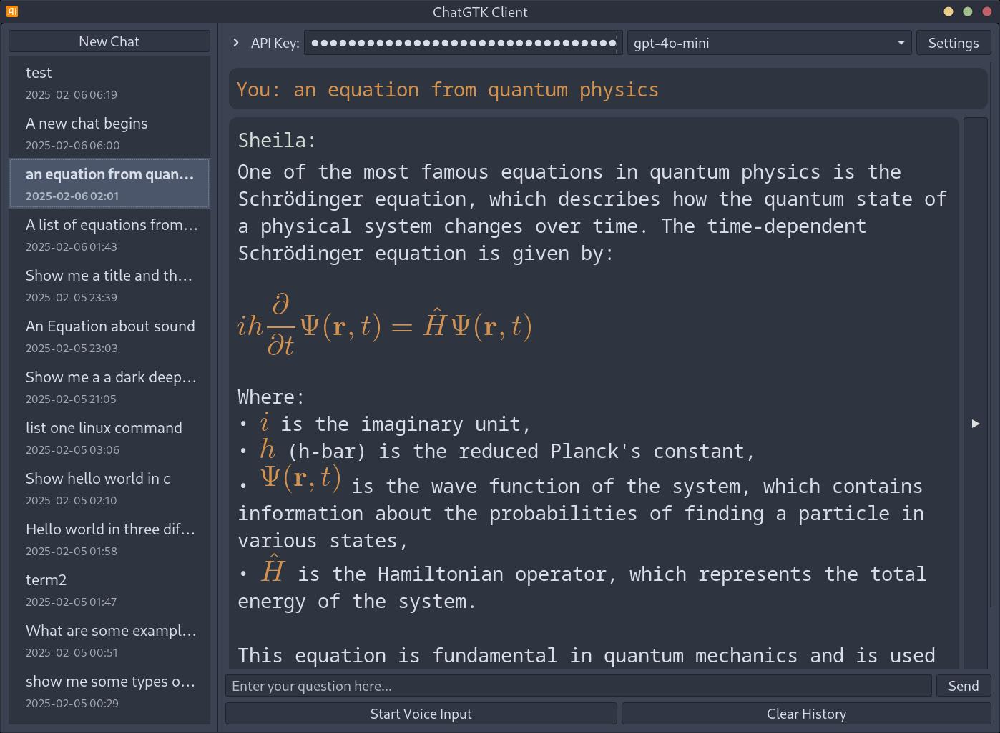

# ChatGTK - OpenAI Chat Client

A GTK-based Linux desktop client for OpenAI's API, featuring voice input/output and a clean interface. This project was primarily generated through AI assistance (Claude, O1, O3-mini).

Disclaimer: Written entirely by AI, I accept no resposibility for what happens to your computer if you choose to run this code!

## Installation

```bash
pip install -r requirements.txt
```

## Usage
The application looks for an enviroment variable: $OPENAI_API_KEY

```bash
python3 ./ChatGTK.py
```

## Features

- Clean GTK3 interface
- Voice input with Whisper API
- Text-to-Speech output
- Syntax highlighting for code blocks
- LaTeX formula rendering
- Customizable settings
- Conversation history management
- Image generation using Dall-e-3 model
- Export chats to PDF by right-clicking on a chat and selecting "Export Chat"

## Screenshots

*Syntax highlighting*


*Support for Equations*


*Settings Dialog*


*Image Generation*


## Python Packages
- openai>=1.0.0
- PyGObject>=3.42.0
- sounddevice>=0.4.6
- soundfile>=0.12.1
- numpy>=1.24.0
- pathlib>=1.0.1

## System Dependencies
- python3
- gtk-3.0
- gtksourceview4
- pulseaudio
- texlive (for LaTeX support)
- dvipng (for LaTeX rendering)

<a href="https://www.buymeacoffee.com/rabfulton" target="_blank"></a>